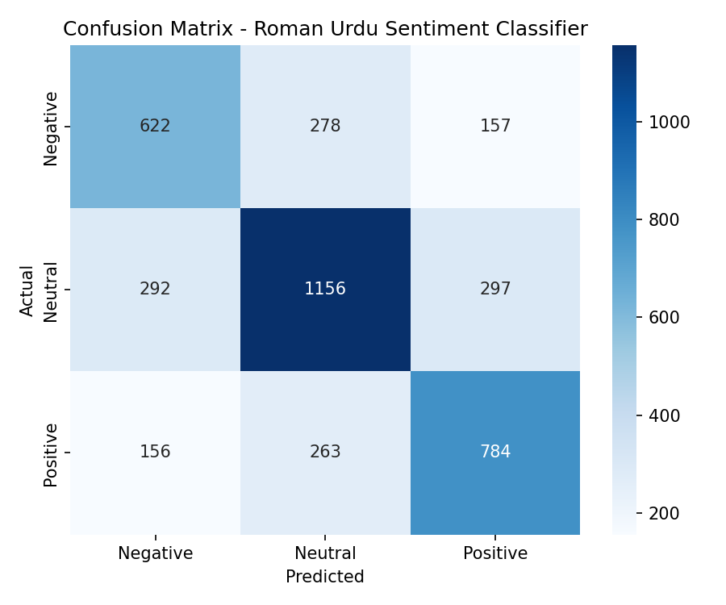

<h1 align="center">🇵🇰 Roman Urdu Sentiment Analysis</h1>

<p align="center"><strong>Roman Urdu sentiment classification using NLP, TF-IDF, and Logistic Regression.</strong></p>
<p align="center"><em>Clean → Vectorize → Classify → Evaluate → Analyze Feedback</em></p>

---

## 📌 Overview

Roman Urdu is Urdu written in the Latin alphabet and is widely used in online conversations, reviews, and social media. Its spelling is highly variable, which makes standard English-focused NLP pipelines less reliable.

This project builds an end-to-end sentiment analysis pipeline for Roman Urdu: text preprocessing → TF-IDF feature engineering → balanced Logistic Regression → evaluation → CLI inference → interactive Streamlit feedback analysis.

The Streamlit application supports both **single-sentence prediction** and **bulk customer-feedback analysis** from CSV files.

## 🎯 Problem → Solution

**Problem:** Roman Urdu customer comments are difficult to analyze automatically because of inconsistent spelling, informal language, and limited language-specific tooling.

**Solution:** A lightweight, interpretable NLP pipeline with Roman Urdu-specific preprocessing and a labeled Roman Urdu dataset.

---

## ✨ Key Features

- 🇵🇰 Roman Urdu-specific preprocessing
- 🧹 URL, mention, hashtag, punctuation, and digit removal
- 🔤 Repeated-character normalization for noisy spellings
- 🛑 Hand-curated Roman Urdu stopword filtering
- 📊 TF-IDF using unigrams + bigrams
- ⚖️ Balanced Logistic Regression
- 📈 Accuracy, weighted F1, classification report, and confusion matrix
- 💻 CLI prediction with class probability scores
- 🌐 Streamlit web application
- ⚡ Quick single-sentence sentiment check
- 📁 Bulk CSV feedback analysis
- 🚨 Negative-feedback prioritization
- 🔎 Frequent complaint-keyword analysis

---

## 🧠 ML Pipeline

```text
Roman Urdu Text
      ↓
Text Cleaning + Stopword Removal
      ↓
TF-IDF (1–2 grams, max 20k features)
      ↓
Balanced Logistic Regression
      ↓
Sentiment + Probability Scores
```

### Preprocessing

`src/preprocess.py` lowercases text, removes URLs/mentions/hashtags/digits/punctuation, normalizes whitespace, reduces repeated characters, and optionally removes Roman Urdu stopwords.

### Model

`src/train.py` uses:

- `TfidfVectorizer(ngram_range=(1, 2), max_features=20000, min_df=2)`
- `LogisticRegression(max_iter=1000, class_weight="balanced", C=5.0)`
- stratified 80/20 train-test split

### Inference

`src/predict.py` loads the saved pipeline and returns the predicted sentiment plus probability scores for each class.

---

## 📊 Model Results

Current documented baseline:

| Metric | Result |
|---|---:|
| Accuracy | ~64% |
| Weighted F1 | ~0.64 |
| Classes | Positive / Negative / Neutral |

Training also generates a full classification report and confusion matrix.

> **Note:** This is a baseline model, not a production-grade accuracy claim. Roman Urdu sentiment remains challenging because of spelling variation, code-switching, sarcasm, context, and limited labeled data.

---

## 🌐 Streamlit Application

The application has two modes:

### ⚡ Quick Check

Enter a Roman Urdu sentence and receive:

- predicted sentiment
- confidence score

### 📊 Bulk Feedback Analysis

Upload a CSV of Roman Urdu customer comments/reviews and select the text column. The app can generate sentiment results, confidence scores, negative comments to prioritize, and frequent complaint keywords.

This turns the classifier into a small **customer-feedback intelligence workflow** rather than only a model demo.

Run locally with:

```bash
streamlit run streamlit_app.py
```

---

## 📁 Project Structure

```text
-Roman-Urdu-Sentiment-Analysis/
├── data/
│   └── roman_urdu_dataset.csv
├── models/
│   ├── sentiment_pipeline.joblib
│   ├── metrics.json
│   └── confusion_matrix.png
├── src/
│   ├── preprocess.py
│   ├── train.py
│   └── predict.py
├── streamlit_app.py
├── requirements.txt
├── .gitignore
├── LICENSE
└── README.md
```

---

## 🚀 Setup

```bash
git clone https://github.com/moizaiqbal40-ops/-Roman-Urdu-Sentiment-Analysis.git
cd -Roman-Urdu-Sentiment-Analysis
pip install -r requirements.txt
```

Train the model:

```bash
python src/train.py
```

Generated artifacts:

```text
models/sentiment_pipeline.joblib
models/metrics.json
models/confusion_matrix.png
```

### CLI prediction

```bash
python src/predict.py --text "yeh cheez bohat zabardast hai"
```

Or use interactive mode:

```bash
python src/predict.py
```

---

## 🗃️ Dataset

The project uses the **Roman Urdu Dataset** attributed to Zareen Sharf. The project documentation describes a manually labeled dataset containing 20,000+ Roman Urdu sentences collected from sources including e-commerce reviews, Facebook comments, and tweets.

Dataset credit:

- [Roman Urdu Dataset on GitHub](https://github.com/Smat26/Roman-Urdu-Dataset)
- [UCI Machine Learning Repository](https://archive.ics.uci.edu/ml/datasets/Roman+Urdu+Data+Set)

Please follow the original dataset's licensing and attribution requirements.

---

## 🔬 Engineering Decisions

### Why TF-IDF + Logistic Regression?

A lightweight baseline is useful before moving to transformers. It is fast, inexpensive, interpretable, and easy to debug.

### Why preprocessing?

Roman Urdu has no fixed spelling standard and frequently contains informal or repeated-letter spellings. Normalizing common noise helps create more consistent features.

### Why probability scores?

The model exposes class probabilities so predictions can be inspected rather than treated as unexplained labels.

---

## 📸 Screenshots

<!--
Add final screenshots when ready.



-->

---

## ⚠️ Current Limitations

- Baseline accuracy is around 64%.
- Spelling variation and Roman Urdu + English code-switching remain difficult.
- TF-IDF has less contextual understanding than transformer models.
- Sarcasm and implicit sentiment can be difficult to classify.
- The model may generalize differently across domains.

---

## 🚧 Future Improvements

- Fine-tune multilingual transformers such as **mBERT** or **XLM-R**.
- Experiment with fastText or other Urdu-aware embeddings.
- Expand Roman Urdu spelling normalization.
- Add stemming/lemmatization experiments.
- Add cross-validation and systematic hyperparameter tuning.
- Perform class-level error analysis.
- Improve code-switching handling.
- Add automated tests and CI.
- Add persistent analytics and exportable reports.

---

## 🎯 What This Project Demonstrates

- Natural Language Processing
- supervised machine learning
- text preprocessing
- TF-IDF feature engineering
- Logistic Regression classification
- imbalanced-class handling
- model evaluation
- probability-based inference
- Python project structure
- CLI tooling
- Streamlit application development
- CSV data workflows
- practical ML product thinking

---

## 👩‍💻 Portfolio Positioning

A focused NLP project addressing a real low-resource language setting. It demonstrates the complete path from noisy Roman Urdu text to a usable customer-feedback analysis interface, while keeping the underlying ML pipeline lightweight and explainable.
